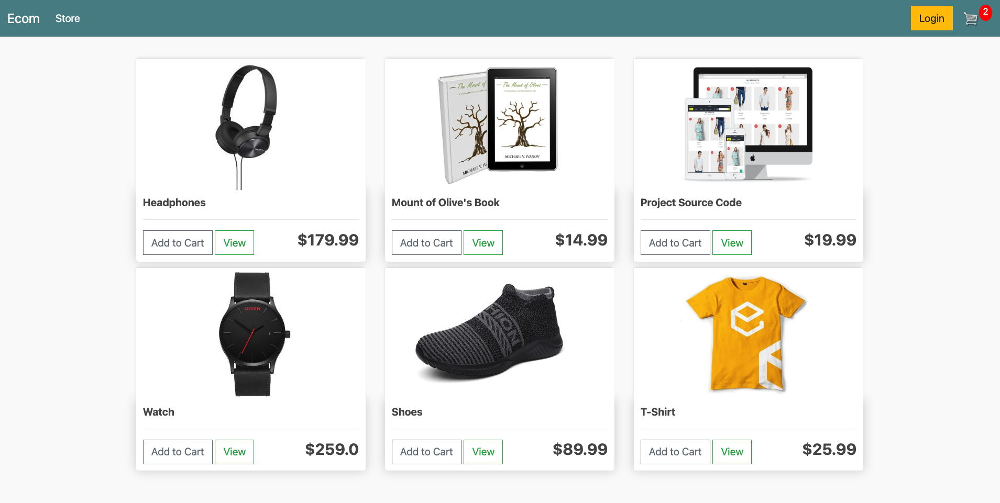

# Django eCommerce website
# E-Commerce Platform 🛒

This is a full-featured e-commerce web application built using Django.
 🔥 Features
- User registration & login
- Product listings & categories
- Shopping cart & checkout
- Order history
- Admin dashboard

🛠️ Tech Stack
- Python, Django
- HTML/CSS/Bootstrap
- SQLite / PostgreSQL

🚀 Setup Instructions
1. Clone the repo
2. Install dependencies
3. Run migrations
4. Start the development server

## 📸 Screenshots
(Include images here if you have any)

## 📂 Project Structure
(Explain important folders and files)

## 🤝 Contributing
Pull requests are welcome!

